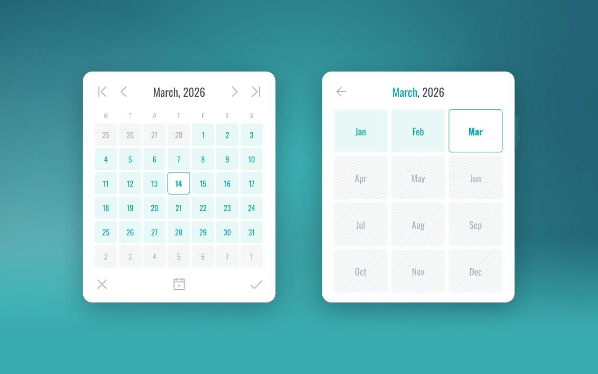

# soCalendar

  

soCalendar is a beautiful & simple calendar date picker in TypeScript designed to be beautifully simple, intuitive and lightweight. It is build to be accessible and using modern semantic markup.



## Demo

Check out the [soCalendar demo](https://stewartorr.github.io/soCalendar/).

## Usage

### Bundler

```
import "socalendar/css"; // or "socalendar/css.min"
import { soCalendar } from "socalendar";
```

### CDN usage

#### Import the CSS file

```
<link href="https://cdn.jsdelivr.net/npm/socalendar/dist/css/socalendar.min.css" rel="stylesheet">`
```


#### Import the javascript file

```
<script src="https://cdn.jsdelivr.net/npm/socalendar/dist/js/socalendar.browser.min.js"></script>
<script>
  const calendar = new SoCalendar();
</script>
```

## Design

Designed and prototyped in Figma, you can see the basic interactions to see what it looks like.

### Figma prototype

https://www.figma.com/proto/lv1vTydLdjuYLOuKXEv8Ek/Calendar---Date-Picker-UI?page-id=0%3A1&node-id=6-163&viewport=3641%2C1030%2C1&t=WwmvSZbOYIhRwV3l-1&scaling=min-zoom&content-scaling=fixed&starting-point-node-id=6%3A163

## Development

Built in TypeScript & SCSS, it uses Vite to help build and test changes quickly as part of the development process.

```
npm install
npm run dev
```

## Designer & Author

soCalendar was designed and developed by Stewart Orr (https://www.stewartorr.co.uk/socalendar).

## Credits

The icons are from the beautiful library [Phosphor Icons](https://phosphoricons.com/).

The font used in the calendar is [Oswald](https://fonts.google.com/specimen/Oswald)